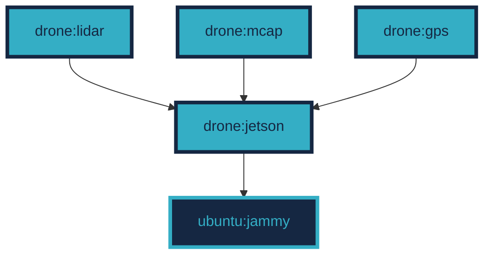

# docker_ros2_images
ROS2 docker images

[](https://docs.ros.org/en/humble/)

## Structure



### Build 
```bash
git clone https://github.com/jkk-research/docker_ros2_images
```

```bash
cd docker_ros2_images/src/drone
```

```bash
docker build -f jetson.Dockerfile -t drone:jetson .
```

```bash
docker build -f gps.Dockerfile -t drone:gps .
```

```bash
docker build -f mcap.Dockerfile -t drone:mcap .
```

```bash
docker build -f lidar.Dockerfile -t drone:lidar .
```


### Run GPS Image
```bash
docker run -it --rm --privileged=true --network=host --ipc=host --pid=host --name gps1 drone:gps
```

``` bash
ros2 launch drone_bringup gps1.launch.py
```

### Run MCAP Image
```bash
docker run -it --rm -v /home/nvidia/bag/:/bag --privileged=true --network=host --ipc=host --pid=host --name mcap1 drone:mcap 
```

```bash
cd /home/ros2_ws/src/jkk_utils/drone_bringup/etc && ./record_mcap1.sh drone1_
```


### Run LIDAR Image
```bash
docker run -it --rm --privileged=true --network=host --ipc=host --pid=host --name lidar1 drone:lidar
```

```bash
ros2 launch drone_bringup lidar1.launch.py
```

### Run Jetson Humble Image

**Note**: It's just a base image, but in case you need it:

```bash
docker run -it --rm --privileged=true --network=host --ipc=host --pid=host --name jetson1 drone:jetson 
```

### Copy
``` bash
rsync -avzh --progress nvidia@192.168.1.30:/home/nvidia/bag/ /home/he/bag/
receiving incremental file list
```


## Related
- Wiki page: https://github.com/szenergy/szenergy-public-resources/wiki/ROS-2-humble-jeston-docker
- Docker hub `dustynv/ros`: [https://hub.docker.com/r/dustynv/ros](https://hub.docker.com/r/dustynv/ros/tags?page=1&name=humble)
- Docker hub `ubuntu/jammy`: [ttps://hub.docker.com/layers/library/ubuntu/jammy](https://hub.docker.com/layers/library/ubuntu/jammy/images/sha256-c9cf959fd83770dfdefd8fb42cfef0761432af36a764c077aed54bbc5bb25368?context=explore)
- Jetson containers repo: https://github.com/dusty-nv/jetson-containers


